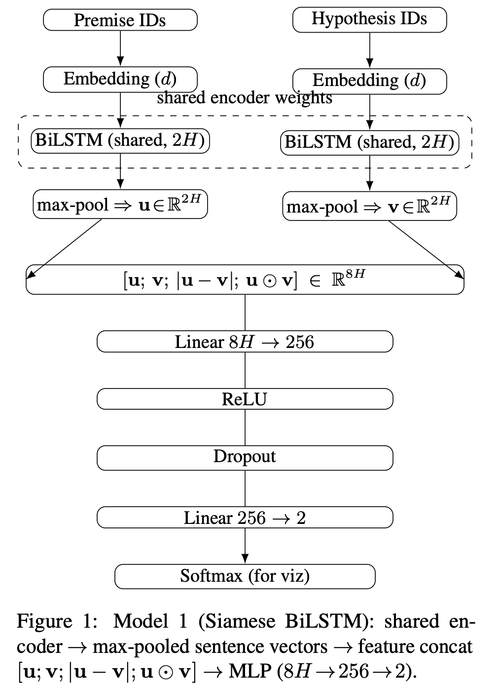
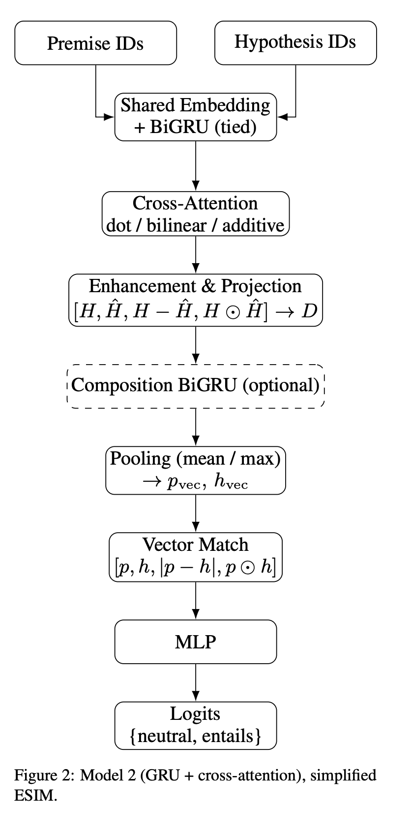
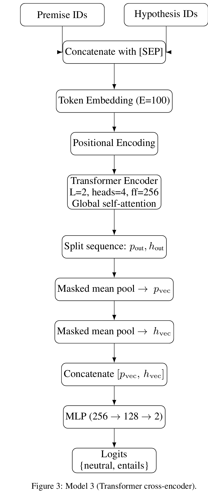
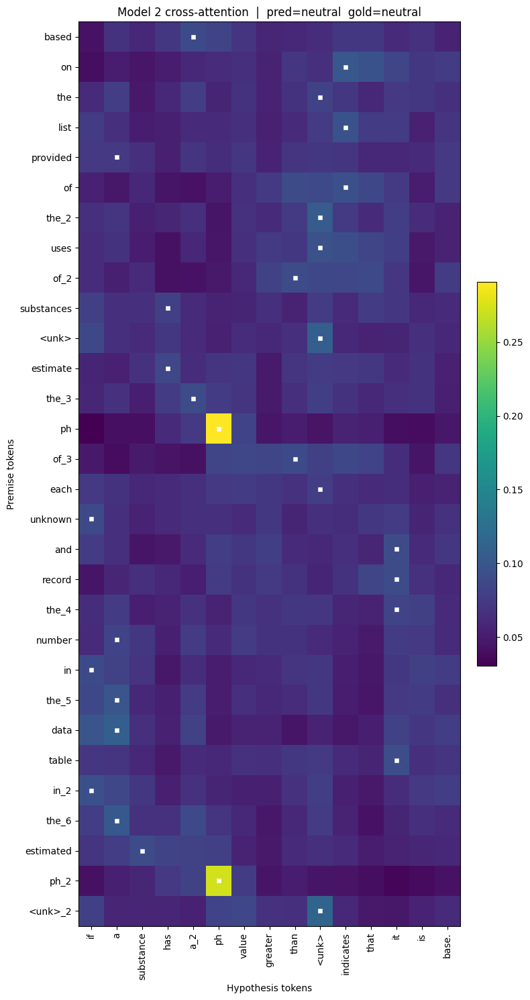

# 🧠 Natural Language Inference: Comparing Three Architectures From Scratch

A comparison of three neural architectures for Natural Language Inference (NLI), implemented from scratch in PyTorch with no pretrained embeddings or transformer weights — a group project for the Natural Language Processing unit (CITS4012) at the University of Western Australia.

## 🎯 Objective

Given a premise and a hypothesis, predict whether the hypothesis is **entailed** by the premise or **neutral** with respect to it. Rather than fine-tuning a pretrained model, this project builds and trains three architectures of increasing complexity entirely from scratch, to study how architectural choices (attention type, pooling strategy, cross-sentence interaction) affect performance under identical data and training conditions:

1. **Model 1 — Siamese BiLSTM**, with an ablation over pooling/self-attention strategies
2. **Model 2 — ESIM-lite** (BiGRU encoder + cross-attention + optional composition layer)
3. **Model 3 — Transformer cross-encoder**, trained end-to-end with no pretraining

## 📊 Dataset

Three JSON splits, binary-labelled (`entails` / `neutral`):

| Split | Examples |
|---|---|
| Train | 23,088 (23,047 after cleaning) |
| Validation | 1,304 |
| Test | 2,126 |

**Preprocessing** ([`nli_models_comparison.ipynb`](nli_models_comparison.ipynb), sections 1–2):
- Deterministic text normalization applied consistently before tokenization and dedup checks
- Found and removed 31 duplicate rows within the training set and 10 train–test overlaps, to prevent leakage
- Whitespace tokenizer with a frequency-based vocabulary (`min_freq=2`) built only from the cleaned training split
- Sequences capped at 64 tokens (premise) / 32 tokens (hypothesis) — truncation affects ≤0.2% of hypotheses and ~0% of premises
- Validation/test out-of-vocabulary rate: ~6.3%, checked against the train-only vocabulary
- Class weights computed from the cleaned training split to counter label imbalance

## 🏗️ Models

**Model 1 — Siamese BiLSTM:** a shared BiLSTM encodes the premise and hypothesis independently; sentence vectors are max-pooled and combined as `[u, v, |u-v|, u⊙v]` and passed to an MLP classifier. Ablated over pooling (max / mean+max) and self-attention type (none / additive / dot-product / multi-head).

**Model 2 — ESIM-lite:** a shared BiGRU encodes both sentences (tied weights), followed by cross-attention (dot / bilinear / additive) that aligns each premise token to the hypothesis and vice versa, an enhancement + projection step, an optional composition BiGRU over the aligned representations, then pooled (mean/max) and classified.

**Model 3 — Transformer cross-encoder:** premise and hypothesis are concatenated as a single sequence (`[premise] [SEP] [hypothesis]`), embedded with trainable token embeddings (E=100) + sinusoidal positional encodings, encoded by a 2-layer, 4-head Transformer encoder built from scratch (no pretrained weights), then split back into premise/hypothesis, masked-mean-pooled, concatenated, and classified by an MLP.

All three share the same training loop, optimizer (AdamW), loss, and evaluation harness for a fair comparison — see section 3 of the notebook.

## 📈 Results

Best variant per model, evaluated on the held-out test set:

| Model | Best variant | Test Acc | Macro-F1 |
|---|---|---|---|
| Model 1 — BiLSTM | No attention (max pooling) | 0.7611 | 0.7511 |
| Model 2 — ESIM-lite | Bilinear attention + composition GRU | 0.7615 | 0.7518 |
| Model 3 — Transformer | Cross-encoder | 0.6994 | 0.6744 |

**Key findings:**
- The BiLSTM and ESIM-lite models perform almost identically (~76% accuracy) despite ESIM-lite's added cross-attention and composition machinery — the extra architectural complexity didn't translate into a meaningful gain on this dataset/scale.
- The from-scratch Transformer underperforms both recurrent models by ~6 points, consistent with the well-known result that transformer encoders need either much more data or pretraining to beat inductive-bias-rich architectures like LSTMs/GRUs when trained from random initialization.
- **Attention ablation (Model 1):** additive self-attention pooling was the best-performing attention variant (0.7590 test acc), though still narrowly behind plain max pooling.
- **Composition ablation (Model 2):** bilinear attention + composition GRU was the strongest configuration (0.7372 test acc among composition variants).
- **Pooling ablation:** combined mean+max pooling (0.7560) outperformed either strategy alone.

### Cross-attention visualization

Attention weights from Model 2 (ESIM-lite) for a correctly predicted **neutral** example, showing how each premise token distributes attention across the hypothesis.

## 🧠 Technologies Used

| Component | Technology |
|---|---|
| Modelling | PyTorch (`nn.LSTM`, `nn.GRU`, custom Transformer encoder, `nn.Embedding`) |
| Data pipeline | `torch.utils.data.Dataset`/`DataLoader`, custom tokenizer & vocabulary |
| Analysis & viz | pandas, numpy, matplotlib |
| Training | AdamW, class-weighted loss, fixed seeding (`SEED=42`) for reproducibility |

## 📁 Contents

- `nli_models_comparison.ipynb` — full pipeline: preprocessing, all 3 model implementations, training/evaluation, ablations, and the attention visualization
- `screenshots/` — cross-attention heatmap exported from the notebook

Note: the dataset JSON files aren't included in this repo (course-provided coursework material) — the notebook shows the full preprocessing and modelling pipeline and can be re-run against an equivalent NLI dataset.

## 👥 Team & Contributions

Built as a group project for UWA's Natural Language Processing unit (Semester 2, 2025):

- **Muneef Muhammed** — implemented Model 1 (Siamese BiLSTM); designed and executed the preprocessing/normalization pipeline; managed the notebook experiments and runs
- **Sandra** — implemented Model 2 (ESIM-lite: BiGRU + cross-attention); ran the composition/attention ablations; co-authored documentation
- **Priya** — implemented Model 3 (Transformer cross-encoder); designed the additional ablations; co-authored documentation

This repository shares the technical build (preprocessing, all three model implementations, training, evaluation, and ablations); the full written report (methodology, complete ablation discussion, and qualitative error analysis) is joint coursework and isn't reproduced here in full.
